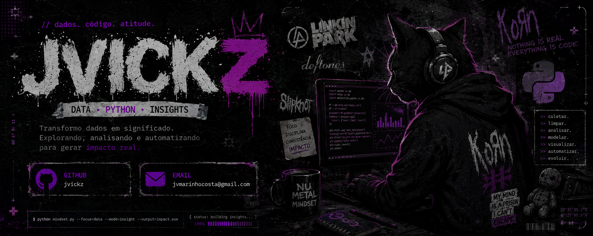

  

---

### Olá, eu sou **João Vitor**  

Programador apaixonado por tecnologia, programação e criação de soluções criativas.

Formado em Ciência de Dados, atualmente estudando **Machine Learning, Cyber Security, Java, C++ e Banco de Dados**.

---

## 🚀 Sobre mim

- 🎓 Estudante de Ciência da Computação
- 💻 Focado em Ciência de Dados, Python e análise de dados
- 📚 Sempre aprendendo novas tecnologias
- 🎯 Buscando evoluir como desenvolvedor

---

## 🌐 Conecte-se comigo

---

## 🛠️ Minha Stack

---

---

<picture align="center">
  <source media="(prefers-color-scheme: dark)" srcset="https://raw.githubusercontent.com/jvickz/jvickz/output/github-contribution-grid-snake-dark.svg">
  <source media="(prefers-color-scheme: light)" srcset="https://raw.githubusercontent.com/jvickz/jvickz/output/github-contribution-grid-snake-dark.svg">
  
</picture>

